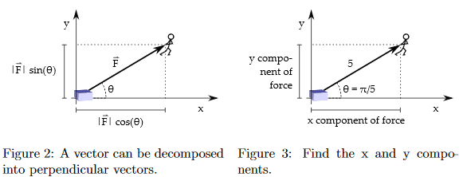

# Data Science Assignment 2 - Vector Fun
### [Assignment Link](Assignment_vectors.pdf) 

## Vector Basics

a)

b)

c)

  

d)

e)

1. 

2. 

3. 

4. 

5. 

## Vector Decomposition

 

f)

 

g)

h)

## Multiplication of a Vector with a Scalar

i)

j)

k)

l)

m)

